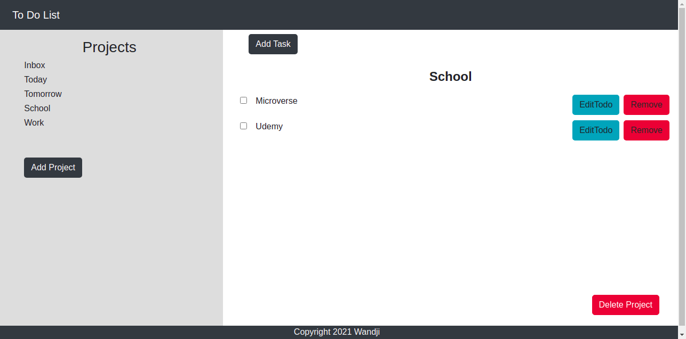

# To Do App

A simple Todo app where a user can:

- Create Projects
- Create Todos for each project
- Edit Todos
- Remove Projects or Todos

## Built With

- JavaScript
- HTML
- CSS
- Webpack
- Bootstrap

## Live demo

[Live Demo](https://elastic-goldstine-735b20.netlify.app/)

## Getting Started

To set up a local copy of the project

- `git clone https://github.com/wandji20/To-Do-List`
- `cd To-Do-List`
- `npm install`

## Author

👤 **Wandji Bertrand**

- Github: [@wandji20](https://github.com/wandji20)
- Twitter: [@wandjibertrand](https://twitter.com/wandjibertrand)
- Linkedin: [Linkedin](https://www.linkedin.com/in/wandji-bertrand/)

## 🤝 Contributing

Contributions, issues, and feature requests are welcome!

## Show your support

Give a ⭐️ if you like this project!

## Acknowledgments

- To Microverse for their `README` template..

## 📝 [License](LICENSE)
